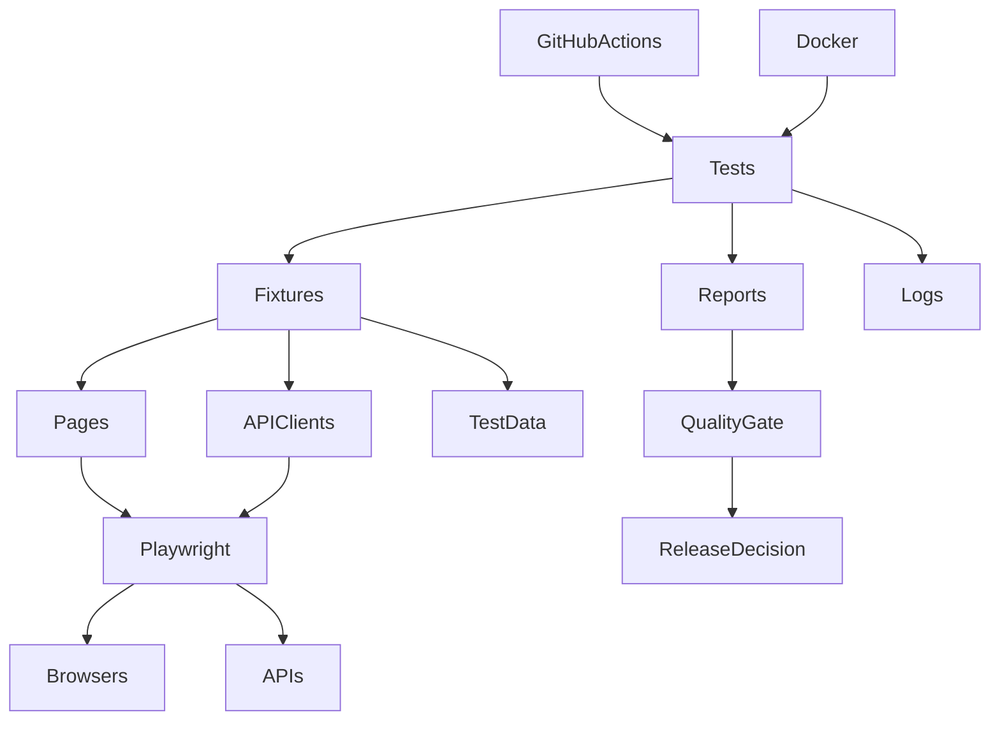

# Playwright Enterprise Test Framework

[](https://playwright.dev/)
[](https://www.typescriptlang.org/)
[](https://nodejs.org/)
[](https://github.com/ashokmanohar-ai/playwright-enterprise-test-framework/actions/workflows/ci.yml)
[](LICENSE)

> **Recruiter signal:** Test Architect-level automation design using native Playwright + strict TypeScript, UI/API/integration coverage, scalable execution, evidence-rich reporting and governed release decisions.

**Part of the broader AI Quality Engineering portfolio:** [Live AI Assurance Portfolio](https://enterprise-ai-quality-portfolio-recruiter-showcase-v700x0.v2.appdeploy.ai/)

## The problem

Enterprise test automation fails when it becomes a collection of disconnected scripts. Delivery teams need fast PR feedback, deeper regression evidence, reliable diagnostics, secure configuration and a release decision that can be defended.

This framework demonstrates how to build one maintainable execution model across browser, API, integration, accessibility and visual testing without hiding Playwright behind a heavy custom abstraction.

## Architecture



**Design principle:** keep business intent in tests, application-specific behaviour in typed pages/clients/fixtures, and release policy in an explicit quality gate.

## Engineering evidence

| Area | Evidence |
| --- | --- |
| Browser automation | Chromium, Firefox, WebKit, optional Edge and mobile emulation |
| API quality | Playwright request context, typed clients and Zod contracts |
| Integration | API setup feeding browser verification with explicit cleanup |
| Accessibility | Axe-based A/AA checks with attached violation evidence |
| Visual quality | Controlled screenshot regression on deterministic surfaces |
| Scale | Parallel workers, retries in CI and three-way sharding |
| Diagnostics | HTML/JSON/JUnit, screenshots, video, traces and structured logs |
| Governance | Configurable release gate, least-privilege CI and secret redaction |
| Reproducibility | Docker, Node 22 LTS, strict TypeScript, deterministic local API path |

## Measurable quality controls

Default quality-gate policy requires:

- **100% smoke pass rate**
- **≥98% regression / overall pass rate**
- **Zero critical test failures**
- **Zero critical accessibility findings**
- Missing result evidence does **not** silently pass

These are framework thresholds for the reference implementation, not claims about a customer production system.

## 5-minute proof

Credential-free API path:

```bash
npm ci
npx playwright install chromium
cp .env.example .env
npm run test:api:local
```

Expected proof: a deterministic Playwright API run with typed contract validation plus HTML, JSON and JUnit evidence.

Useful commands:

```bash
npm run test:smoke
npm run test:regression
npm run test:api
npm run test:integration
npm run test:accessibility
npm run test:visual
npm run test:cross-browser
npm run quality-gate
```

## Core capabilities

- UI, API, integration, accessibility and visual checks
- Page Objects, focused fixtures, API clients, Zod contracts and data factories
- DEV / QA / UAT configuration with validation
- Reusable authentication state excluded from Git
- Parallel execution and three-way CI sharding
- HTML, JSON, JUnit and optional Allure reporting
- Failure screenshots, video and traces
- Structured logging with sensitive-field redaction
- GitHub Actions and Docker execution
- ESLint, Prettier and strict TypeScript

## Technology stack

| Concern | Choice |
| --- | --- |
| Runtime | Node.js 22 LTS |
| Automation | Playwright Test |
| Language | TypeScript strict mode |
| Runtime validation | Zod |
| Accessibility | Axe + Playwright |
| Logging | Pino |
| CI | GitHub Actions |
| Container | Official Playwright image |

## Test architecture

```text
config/                 Typed environment schema and DEV/QA/UAT defaults
src/pages/              Focused Page Objects
src/api/                REST clients, models, schemas and helpers
src/fixtures/           Authentication, API, data and page fixtures
src/data/               Factories and non-sensitive static test inputs
src/assertions/         Small value-adding assertion helpers
src/accessibility/      Axe scanner and evidence formatter
tests/                  UI, API, integration, accessibility, visual, setup
scripts/                Environment, workflow, cleanup and quality-gate tools
.github/workflows/      PR, nightly regression, accessibility automation
docs/                   Design, strategy, operation and interview guidance
```

## Enterprise execution model

```text
Requirement / Risk
→ Test Design
→ Typed Fixture / Client / Page
→ Playwright Execution
→ Browser/API Evidence
→ Report + Trace + Logs
→ Quality Gate
→ Release Decision
```

## Security and governance

- Credentials, session state, reports and local environment files are ignored
- Logs redact passwords, tokens, authorization headers and cookies
- CI permissions are read-only
- Retries are used only in CI and always retain evidence
- Generated data is isolated per test
- No hard-coded sleeps
- Quality gates fail closed when expected evidence is missing

See [SECURITY.md](SECURITY.md).

## MCP / agentic browser-testing perspective

The companion white paper, **[Playwright MCP for Enterprise Test Automation: Architecture, Security Boundaries and Governance for Agentic Browser Testing](WHITEPAPER.md)**, covers browser-state governance, authentication, authorization, storage-state protection, least-privilege identities, prompt injection, consequential actions, human approval, deterministic evidence and agent evaluation.

> MCP exposes browser automation capability; the browser session carries identity; the application remains authoritative for authorization.

## Demo targets and limitations

The reference suite uses public/synthetic demo systems such as SauceDemo and JSONPlaceholder. Public service availability and rate limits are outside the repository's control. JSONPlaceholder simulates mutations rather than persisting them. Automated accessibility checks complement, but do not replace, manual accessibility review.

## Documentation

- [Architecture](docs/architecture.md)
- [Framework Design](docs/framework-design.md)
- [CI/CD](docs/ci-cd.md)
- [Test Data Management](docs/test-data-management.md)
- [Troubleshooting](docs/troubleshooting.md)
- [Interview Walkthrough](docs/interview-walkthrough.md)
- [Technical White Paper](WHITEPAPER.md)

## Recruiter demo path

For a short interview walkthrough:

1. Explain the problem: disconnected automation cannot produce reliable release evidence.
2. Show the architecture and typed boundaries.
3. Run the credential-free API test path.
4. Open the HTML/JUnit/JSON evidence.
5. Show the quality gate and explain why missing evidence fails closed.
6. Connect the framework to the broader [AI Quality Engineering portfolio](https://enterprise-ai-quality-portfolio-recruiter-showcase-v700x0.v2.appdeploy.ai/).

## Role alignment

**Test Architect · Quality Engineering Architect · Automation Architect · Senior/Lead SDET · AI Test Automation Architect**

## Contributing and licence

See [CONTRIBUTING.md](CONTRIBUTING.md). Released under the [MIT License](LICENSE).
