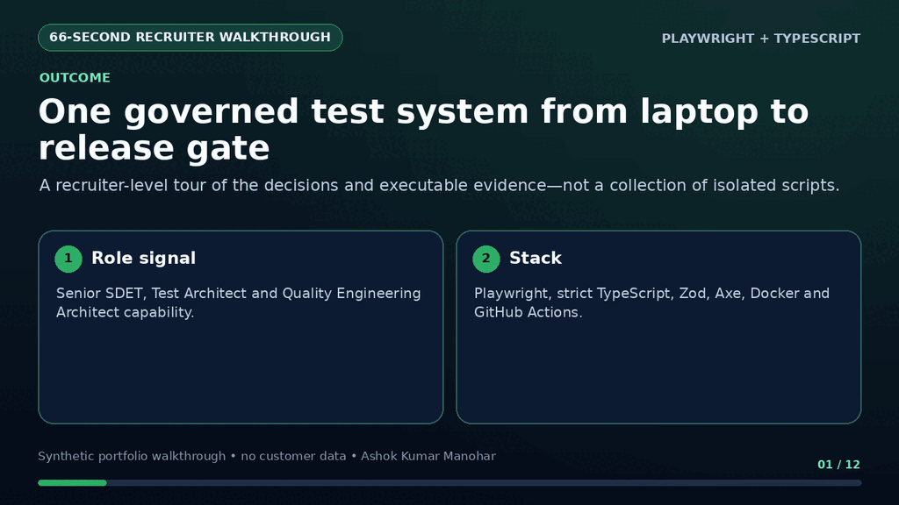
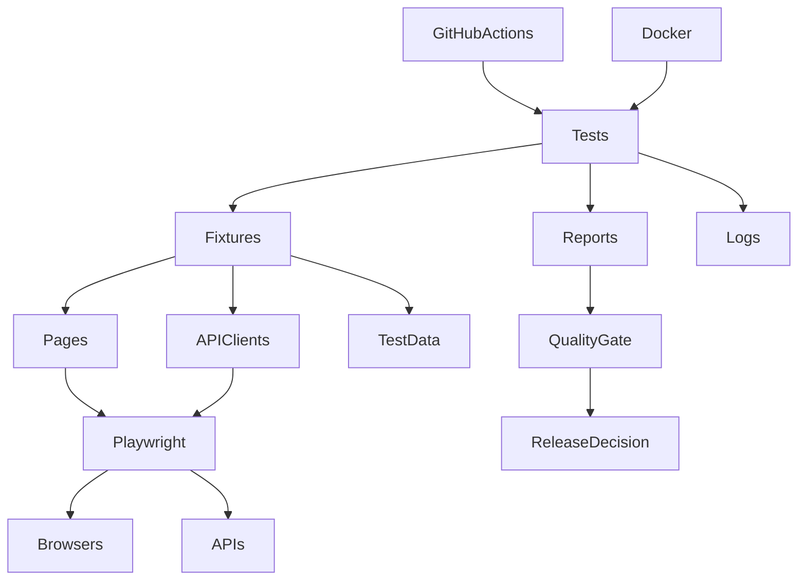

# Playwright Enterprise Test Framework

[](https://playwright.dev/)
[](https://www.typescriptlang.org/)
[](https://nodejs.org/)
[](https://github.com/ashokmanohar-ai/playwright-enterprise-test-framework/actions/workflows/ci.yml)
[](LICENSE)

Enterprise-grade Quality Engineering reference implementation using Playwright + TypeScript.

## Recruiter quick tour

<p align="center">
  
</p>

> **60-second decision:** this repository proves Test Architect-level framework design: native Playwright + strict TypeScript, UI/API/integration coverage, scalable execution, useful failure evidence, and governed CI/CD release decisions.

| Recruiter question | Verifiable answer |
| --- | --- |
| **Problem** | Delivery teams need fast PR feedback and deeper release evidence without maintaining disconnected automation stacks. |
| **Architecture** | Readable tests use typed fixtures, Page Objects, API clients, Zod contracts and data factories; Playwright produces browser/API evidence consumed by a configurable quality gate. |
| **Evidence** | Cross-browser execution, three-way sharding, deterministic local API tests, accessibility and visual checks, structured logs, traces, screenshots, HTML/JSON/JUnit reports, Docker and GitHub Actions. |
| **Role signal** | Senior/Lead SDET, Test Architect, Automation Architect and Quality Engineering Architect. |

**Five-minute proof — credential-free API path**

```bash
npm ci
npx playwright install chromium
cp .env.example .env
npm run test:api:local
```

Expected proof: a deterministic Playwright API run with typed contract validation and HTML, JSON and JUnit evidence. The walkthrough and repository use synthetic/public demo data only.

## 1. Overview

This repository shows how a modern Quality Engineering team can organise browser, REST API,
integration, accessibility, and visual checks without hiding Playwright behind a complex custom
framework. It is designed as a portfolio-quality reference for Senior SDET, Lead SDET, Test
Architect, and Quality Engineering Architect roles.

The suite targets [SauceDemo](https://www.saucedemo.com/) for realistic user journeys and
[JSONPlaceholder](https://jsonplaceholder.typicode.com/) for deterministic REST contracts.
Application-specific behaviour stays behind typed pages, clients, fixtures, factories, and schemas.

## 2. Business Problem

Delivery teams need rapid PR feedback, deeper scheduled regression, useful failure evidence, and a
clear release decision. A collection of isolated scripts cannot provide those capabilities safely at
scale. This reference implementation provides one governed execution model from laptop to CI and
container.

## 3. Key Features

- UI, API, integration, accessibility, and visual checks
- Chromium, Firefox, WebKit, optional Edge, and optional mobile emulation
- Typed DEV, QA, and UAT configuration with Zod validation
- Reusable authentication state excluded from Git
- Page Objects, focused fixtures, API clients, Zod contracts, and data factories
- Parallel workers, retries in CI, and three-way sharding
- HTML, JSON, JUnit, and optional Allure reporting
- Failure screenshots, retained-on-failure videos, and first-retry traces
- Pino structured logging with sensitive-field redaction
- Configurable release quality gate
- GitHub Actions and Docker execution
- ESLint, Prettier, and strict TypeScript

## 4. Architecture



See [Architecture](docs/architecture.md) and [Framework Design](docs/framework-design.md).

## 5. Technology Stack

| Concern       | Choice                    | Why                                            |
| ------------- | ------------------------- | ---------------------------------------------- |
| Runtime       | Node.js 22 LTS            | Supported, stable enterprise runtime           |
| Automation    | Playwright Test           | Browser, request, fixtures, assertions, traces |
| Language      | TypeScript strict mode    | Refactoring safety and explicit contracts      |
| Validation    | Zod                       | Runtime configuration and response contracts   |
| Accessibility | Axe with Playwright       | Automated WCAG rule checks                     |
| Logging       | Pino                      | Fast structured logs with redaction            |
| CI            | GitHub Actions            | PR, schedule, matrix, sharding, artifacts      |
| Container     | Official Playwright image | Browser/system dependency alignment            |

## 6. Repository Structure

```text
config/                 Typed environment schema and DEV/QA/UAT defaults
src/pages/              Focused Page Objects
src/api/                REST clients, models, schemas, and helpers
src/fixtures/           Authentication, API, data, and page fixtures
src/data/               Factories and non-sensitive static test inputs
src/assertions/         Small value-adding assertion helpers
src/accessibility/      Axe scanner and evidence formatter
tests/                  UI, API, integration, accessibility, visual, setup
scripts/                Environment, workflow, cleanup, and quality-gate tools
.github/workflows/      PR, nightly regression, accessibility automation
docs/                   Design, strategy, operation, and interview guidance
```

## 7. Prerequisites

- Node.js 22 LTS
- npm 10 or later
- Git
- Docker Desktop or compatible engine only for container execution

## 8. Installation

```bash
git clone https://github.com/ashokmanohar-ai/playwright-enterprise-test-framework.git
cd playwright-enterprise-test-framework
npm ci
npx playwright install
cp .env.example .env
```

On Windows PowerShell, use `Copy-Item .env.example .env`.

## 9. Configuration

Set local values in `.env`. External environment variables take precedence, and real secrets must
only be stored in a local secret store or GitHub Actions secrets.

```dotenv
TEST_ENV=qa
BASE_URL=https://www.saucedemo.com
API_BASE_URL=https://jsonplaceholder.typicode.com
TEST_USERNAME=<runtime-value>
TEST_PASSWORD=<runtime-value>
HEADLESS=true
```

The public demo login values are intentionally not committed. API-only checks do not require
credentials. Verify resolved non-sensitive values with `npm run validate:env`.

## 10. Environment Management

```bash
npm run test:dev
npm run test:qa
npm run test:uat
```

Each environment has safe public target defaults under `config/environments`. Override them at
runtime for an organisation-specific system. Invalid URLs, environment names, worker counts, and
boolean values fail fast with field-level messages.

## 11. Running Tests

```bash
npm test                  # Chromium application checks + API
npm run test:all          # Every configured project
npm run test:headed
npm run test:debug
npm run test:cross-browser
npm run test:shard:1
```

## 12. Test Categories

```bash
npm run test:smoke
npm run test:regression
npm run test:api
npm run test:api:local        # deterministic offline contract service
npm run test:integration
npm run test:accessibility
npm run test:visual
```

Tags include `@smoke`, `@regression`, `@api`, `@integration`, `@accessibility`,
`@visual`, and `@critical`.

## 13. UI Testing

Business intent stays in tests while locators and actions remain in focused Page Objects:
`LoginPage`, `ProductsPage`, `CartPage`, and `CheckoutPage`. Locators prefer roles, labels,
placeholders, text, test IDs, then CSS. There are no hard-coded sleeps.

## 14. API Testing

Playwright's request context drives typed `PostsApiClient`, `UsersApiClient`, and
`TodosApiClient`. Scenarios cover GET, POST, PUT, PATCH, DELETE, headers, filters, negative
responses, response time, and Zod response contracts.

`npm run test:api:local` starts a deterministic in-repository contract service through
Playwright's `webServer` lifecycle. It validates the same client/schema suite when the public
reference service is unavailable; normal execution still targets the configured environment API.

## 15. Integration Testing

Integration examples use an API for fast setup, pass its typed response across the UI mapping
boundary, verify browser rendering, and make cleanup explicit. JSONPlaceholder simulates mutations;
the limitation is documented rather than disguised.

## 16. Accessibility

`@axe-core/playwright` scans critical pages against WCAG A/AA rules. Critical and serious
violations include rule, impact, help, URL, and affected targets in attached JSON evidence.
Automated checks complement rather than replace keyboard, screen-reader, zoom, and cognitive review.

## 17. Visual Regression

Two intentionally deterministic components demonstrate screenshot baselines without making the
whole suite sensitive to public-site styling. Update approved baselines with:

```bash
npm run test:visual -- --update-snapshots
```

Review pixel differences before committing them.

## 18. Parallel Execution

Tests are fully parallel where safe. Authentication state is read-only, each browser context is
isolated, factories create unique data, and no test depends on order. Control workers with
`WORKERS`; distribute CI with `--shard=1/3`, `2/3`, and `3/3`.

## 19. CI/CD

- `ci.yml`: validation, smoke/API/accessibility, quality gate, evidence
- `nightly-regression.yml`: browser matrix with three shards
- `accessibility.yml`: scheduled dedicated WCAG assurance

Equivalent [Jenkins and Azure DevOps templates](docs/ci-cd.md) are documented without becoming local
runtime dependencies.

## 20. Docker

```bash
docker build -t playwright-enterprise-test-framework .
docker run --rm --env-file .env playwright-enterprise-test-framework test:smoke
docker compose up --build --abort-on-container-exit
```

The image is pinned to the matching official Playwright release.

## 21. Reporting

HTML is the default human report. JSON supports the release gate, JUnit integrates with CI, and
Allure is opt-in:

```bash
npm run test:allure
npx allure generate allure-results --clean
```

## 22. Quality Gates

```bash
npm run quality-gate
```

Defaults require 100% smoke, at least 98% regression/overall, zero critical test failures, and zero
critical accessibility findings. All thresholds are configurable through documented environment
variables. Missing result evidence does not silently pass.

## 23. Test Data Strategy

Factories provide valid defaults plus overrides. Static JSON contains only non-sensitive negative
inputs. Credentials remain runtime values. Generated data is independent per test, and integration
cleanup is explicit. See [Test Data Management](docs/test-data-management.md).

## 24. Security Considerations

Credentials, session state, reports, and local environment files are ignored. Logs redact passwords,
tokens, authorisation headers, and cookies. CI permissions are read-only. Review [Security Policy](SECURITY.md).

## 25. Troubleshooting

Use `npm run validate:env`, then inspect the HTML report, trace, screenshot, video, and structured
logs. [Troubleshooting](docs/troubleshooting.md) distinguishes framework defects from public target
outages and credential/configuration errors.

## 26. Design Decisions

- Prefer native Playwright capabilities over wrapper-heavy abstractions.
- Use API setup where it reduces slow, brittle UI preconditions.
- Keep assertions in tests except meaningful page-level validation helpers.
- Retry only in CI and retain evidence; retries do not excuse flaky tests.
- Limit visual coverage to stable, high-value surfaces.

## 27. Limitations

- Public demo availability and rate limits are outside this repository's control.
- JSONPlaceholder acknowledges mutations but does not persist them.
- Edge requires an installed Edge channel and is opt-in.
- Automated accessibility finds only issues detectable by Axe.
- Visual baselines are designed for the pinned Linux browser/container environment.

## 28. Roadmap

The core framework remains deterministic and AI-independent. A future sibling
`ai-test-failure-triage-agent` can consume traces, logs, and screenshots to suggest probable root
causes without changing test verdicts. Kubernetes execution, distributed blob-report merging, and
contract-provider verification are natural scale extensions.

## 29. Interview Talking Points

Use [Interview Walkthrough](docs/interview-walkthrough.md) for two-minute and five-minute
explanations, scaling decisions, flaky-test governance, CI design, secrets, Kubernetes, ALM
integration, and responsible AI-assisted failure analysis.

## 30. Contributing

Read [CONTRIBUTING.md](CONTRIBUTING.md). Every change must pass type checking, lint, formatting,
relevant tests, and evidence review.

## 31. License

MIT — see [LICENSE](LICENSE).
