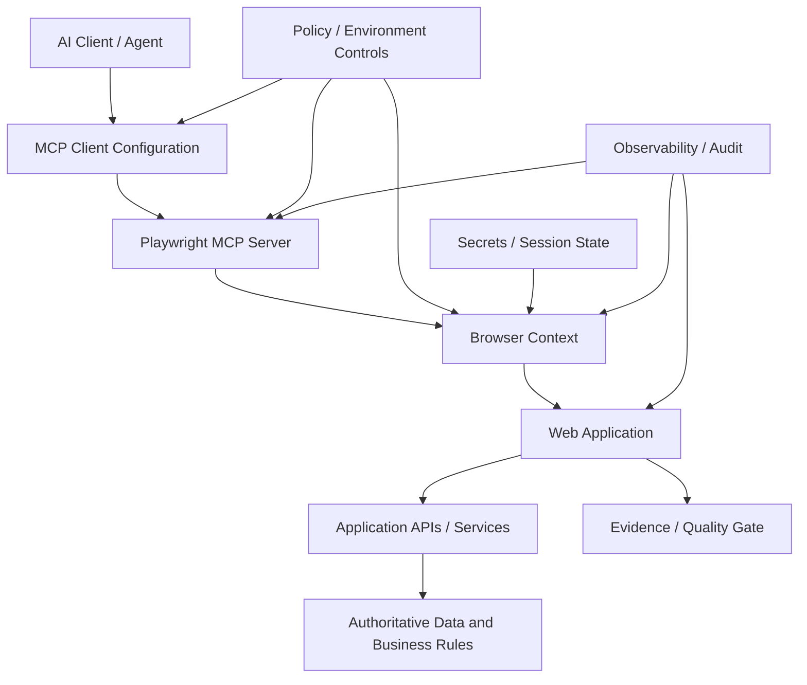

# Playwright MCP for Enterprise Test Automation

## Architecture, Security Boundaries and Governance for Agentic Browser Testing

**Technical White Paper — Version 1.0**  
**September 2026**

**Author:** Ashok Kumar Manohar  
**GitHub:** [ashokmanohar-ai](https://github.com/ashokmanohar-ai)  
**Primary reference implementation:** [Playwright Enterprise Test Framework](https://github.com/ashokmanohar-ai/playwright-enterprise-test-framework)  
**Supporting MCP implementation:** [Enterprise AI Quality Engineering Platform](https://github.com/ashokmanohar-ai/enterprise-ai-quality-engineering-platform)

> **Publication note:** This is an independent technical white paper supported by open-source reference implementations. It is not a peer-reviewed academic publication, legal opinion, penetration-test authorization, compliance certification, security certification, or statement of production readiness. Organizations must validate identity, browser-state, secret-management, network, environment, logging, approval and application-security controls for their own deployment.

---

## Abstract

Playwright has become a widely used foundation for browser automation and end-to-end Quality Engineering. Model Context Protocol (MCP) adds a new interaction model: an AI client can discover browser capabilities and invoke structured Playwright operations through an MCP server. This enables exploratory testing, agent-assisted test creation, adaptive navigation, self-healing investigation, accessibility-tree reasoning and interactive evidence collection.

The same capability also changes the enterprise security and governance model. A browser session can hold authenticated cookies, local storage, application state and access to privileged workflows. An AI agent can navigate faster and more broadly than a human tester. A persistent browser profile can carry ambient authority across tasks. A browser extension can connect an agent to an already authenticated tab. A storage-state file can become a sensitive credential artifact. None of those concerns are solved merely by installing an MCP server.

This white paper presents **Playwright MCP for Enterprise Test Automation** as a governed browser-automation architecture rather than a new authentication mechanism. The framework proposes an **Intent–Session–Capability–Authorization–Evidence–Gate model**. The agent's intent is bounded by explicitly exposed MCP capabilities; the browser session carries a concrete application identity; the application remains authoritative for authentication and authorization; every important action produces retained evidence; and policy gates constrain privileged, destructive or release-significant operations.

The central proposition is:

> **Playwright MCP can automate what a controlled browser session is allowed to do, but it must not be treated as a source of application authority. Trust comes from bounding the browser session, preserving application authorization, constraining exposed capabilities, retaining execution evidence and governing consequential actions.**

---

## 1. Executive Summary

The enterprise question is not simply:

> Can an AI agent control a browser through Playwright MCP?

It is:

> **Under which identity, against which environment, with which browser state, through which exposed capabilities, under which application permissions, with what evidence, and with which approval boundaries may the agent act?**

A practical architecture is:

```text
AI Client / Coding Agent
          ↓
MCP Client Policy
          ↓
Playwright MCP Server
          ↓
Controlled Browser Context
          ↓
Application Authentication
          ↓
Application Authorization
          ↓
UI / API / Business Workflow
          ↓
Evidence + Audit + Quality Gate
```

The architectural rule is:

> **MCP exposes automation capability. The browser session carries identity. The application decides authority.**

This distinction prevents a common misconception: introducing Playwright MCP does not inherently grant a user privileges that the underlying application would deny. However, it can make browser capabilities easier for an agent to invoke, so the MCP server, browser profile, credentials, environment and allowed actions become part of the system's operational attack and governance surface.

---

## 2. What Playwright MCP Is

Playwright MCP is an MCP server that exposes Playwright browser automation as structured tools that an AI client can invoke. Current Microsoft documentation emphasizes accessibility snapshots and structured page information rather than depending primarily on screenshots or vision models.

Typical operations include:

- browser navigation;
- page snapshots;
- element interaction;
- form entry;
- keyboard and pointer actions;
- tabs and pages;
- downloads and uploads where configured;
- browser context and state management;
- structured inspection of page content.

This makes Playwright MCP useful for interactive agentic loops in which an AI system observes page state, chooses an action, executes it and reasons over the next state.

---

## 3. What Playwright MCP Is Not

Playwright MCP is not, by itself:

- an application identity provider;
- an application authorization engine;
- a replacement for OAuth, OIDC, SAML or enterprise SSO;
- a replacement for role-based or attribute-based access control;
- a secret vault;
- a release approval system;
- a substitute for deterministic Playwright Test suites;
- evidence that an application is secure;
- permission to test a third-party system;
- a guarantee that an agent will choose the correct browser action.

The protocol and server create an automation interface. Application security controls remain necessary and authoritative.

---

## 4. Playwright Test, Playwright MCP and Playwright CLI

These mechanisms solve different problems.

| Mechanism | Strongest fit | Control style |
|---|---|---|
| Playwright Test | Repeatable automated regression and CI evidence | Deterministic test code |
| Playwright MCP | Interactive agentic browser loops and rich page introspection | Tool-mediated AI actions |
| Playwright CLI / agent skills | High-throughput coding-agent workflows | Command-oriented agent automation |

A mature Quality Engineering architecture may use all three:

1. MCP for exploration, diagnosis and assisted authoring.
2. Playwright Test for durable regression evidence.
3. CLI or agent skills where command-oriented workflows are more efficient.

The important governance principle is that exploratory agent behavior should become deterministic regression code when the scenario becomes release-critical.

---

## 5. Reference Architecture



The security boundary is not a single box. It is the intersection of:

- MCP client configuration;
- MCP server configuration;
- browser profile and storage state;
- test environment;
- network reachability;
- application authentication;
- application authorization;
- data permissions;
- human approvals;
- retained evidence;
- release policy.

---

## 6. Intent–Session–Capability–Authorization–Evidence–Gate Model

### Intent
What is the agent trying to accomplish?

Examples:

- verify a login flow;
- reproduce a defect;
- explore an accessibility issue;
- generate a candidate regression test;
- create a test-only support ticket.

### Session
Which browser identity and state are active?

### Capability
Which Playwright MCP tools and browser operations are exposed?

### Authorization
What does the application permit that identity to do?

### Evidence
What proves what happened?

### Gate
What policy determines whether the result is accepted, blocked or escalated?

A trustworthy implementation must be able to answer all six.

---

## 7. Application Authentication Remains Authoritative

Playwright MCP can automate a login page or load an approved storage state, but the application still determines whether authentication succeeds.

The browser may receive:

- session cookies;
- access tokens;
- refresh tokens;
- CSRF tokens;
- local-storage state;
- device or SSO state.

Those artifacts belong to the application security model. MCP should not be interpreted as bypassing them.

If the browser session is unauthenticated, MCP should not magically gain application access. If the application session is authenticated as a low-privilege user, MCP should remain constrained by the same authorization controls.

---

## 8. Application Authorization Remains Authoritative

Authentication answers "who is this session?"

Authorization answers "what may this session do?"

A correct enterprise design preserves controls such as:

- RBAC;
- ABAC;
- ownership checks;
- tenant boundaries;
- resource-level authorization;
- workflow approvals;
- server-side business rules;
- least-privilege API permissions.

A browser button being visible is not sufficient proof of authorization. Server-side enforcement remains necessary.

---

## 9. Discovery Is Not Permission

MCP tool discovery tells a client which operations are available through the MCP server. It should never be interpreted as application permission.

For example:

```text
Tool exists: browser_click
        ≠
User is authorized to approve a payment
```

Likewise:

```text
Tool exists: browser_navigate
        ≠
Agent is authorized to access every reachable URL
```

Discovery communicates capability. Policy and application security decide whether a specific use of that capability is acceptable.

---

## 10. Browser State Is a Security Boundary

Browser state can carry real authority.

Important artifacts include:

- cookies;
- local storage;
- IndexedDB;
- cached credentials;
- authenticated tabs;
- browser profiles;
- downloads;
- autofill data;
- extension state.

Treating browser state as disposable test convenience can create privilege leakage between runs.

Enterprise rule:

> **A browser profile must be classified and protected according to the authority it carries.**

---

## 11. Persistent Browser Profiles

A persistent profile can improve agent continuity because login state and browser data survive across sessions.

The same persistence can introduce risks:

- session reuse across unrelated tasks;
- stale privileges after role changes;
- cross-test contamination;
- leftover sensitive data;
- accidental access to earlier tabs or downloads.

Use persistent state only when continuity is justified and the profile is dedicated to a controlled purpose.

Do not use a personal day-to-day browser profile as a generic automation profile.

---

## 12. Isolated Browser Contexts

Isolation is usually the safest default for repeatable enterprise testing.

An isolated context provides:

- fresh browser state;
- lower cross-test contamination;
- reproducible starting conditions;
- easier teardown;
- clearer evidence provenance.

If approved authentication state must be loaded, it should be injected intentionally and scoped to the test identity and environment.

---

## 13. Storage State as a Credential Artifact

A Playwright storage-state file may contain cookies and local-storage values that enable authenticated access.

Therefore:

- do not commit it to source control;
- do not publish it as a CI artifact;
- do not attach it to public defect reports;
- restrict filesystem access;
- rotate or invalidate the underlying session when necessary;
- generate it from an approved identity flow;
- separate state by environment and role.

Treat storage state with the same seriousness as other authentication material.

---

## 14. Browser Extension Mode

Connecting Playwright MCP to existing browser tabs can be powerful for investigation because the agent can operate within an already logged-in session.

It also creates a high-trust mode because the existing browser may contain:

- production access;
- personal sessions;
- privileged administrative tabs;
- customer information;
- unrelated authenticated applications.

For enterprise testing, extension mode should be restricted to dedicated browser profiles and approved test environments unless a stronger risk review explicitly permits otherwise.

---

## 15. Environment Segmentation

Separate:

- local;
- development;
- QA;
- staging/UAT;
- production.

Recommended default:

> **MCP-assisted exploratory automation runs against dedicated non-production environments.**

Production use, if ever required for diagnostics, should use stronger controls:

- read-only identity where possible;
- explicit authorization;
- narrow time window;
- network restrictions;
- retained audit evidence;
- no destructive operations;
- incident ownership.

---

## 16. Network Boundaries

A browser automation agent can navigate to network-reachable destinations.

Control the network surface with:

- allowlisted test domains;
- denied internal management endpoints;
- proxy rules;
- egress filtering;
- test-environment DNS controls;
- private network segmentation;
- blocked metadata services;
- restricted localhost access when appropriate.

Prompt instructions alone are not a network control.

---

## 17. Secrets Management

Secrets may be required for test authentication, API setup or environment access.

Use:

- environment-level secret stores;
- CI secret mechanisms;
- managed identity where supported;
- short-lived credentials;
- dedicated test accounts;
- least privilege.

Avoid embedding secrets in:

- prompts;
- MCP configuration committed to Git;
- screenshots;
- traces;
- reports;
- generated test code;
- console logs.

---

## 18. Test Identities

Create dedicated identities by role and purpose.

Example:

| Identity | Purpose |
|---|---|
| `qe_viewer` | Read-only validation |
| `qe_customer` | Customer workflows |
| `qe_support` | Support-role scenarios |
| `qe_approver` | Explicit approval scenarios |
| `qe_admin` | Rare, controlled administrative testing |

Do not reuse one administrator identity for every automated scenario.

---

## 19. Least Privilege

The effective capability of an MCP-assisted session should be the minimum required for the test objective.

Least privilege applies to:

- application roles;
- browser state;
- network reachability;
- MCP-exposed tools;
- filesystem access;
- uploaded/downloaded files;
- environment secrets;
- CI permissions;
- external services.

---

## 20. Consequential Actions

Some browser actions are low risk:

- open a test page;
- inspect text;
- verify accessibility structure.

Others are consequential:

- submit an order;
- delete data;
- approve a payment;
- send an email;
- modify user permissions;
- upload a file;
- trigger an external workflow.

Consequential actions should have explicit controls such as:

- human approval;
- dedicated sandbox data;
- transaction caps;
- test-only destinations;
- idempotency;
- post-action verification;
- rollback or cleanup.

---

## 21. Human-in-the-Loop Approval

A human approval should be bound to the actual action, not a vague statement such as "the agent may continue."

Approval evidence should identify:

- action type;
- target environment;
- resource or record;
- important parameters;
- identity;
- expected side effect;
- expiry;
- approver.

If the action changes materially, approval should be reevaluated.

---

## 22. Prompt Injection from Web Content

A browser agent reads untrusted application content.

That content may contain text designed to influence the agent, for example:

- malicious instructions in a support ticket;
- injected text in a CMS field;
- untrusted document content;
- HTML that tells the agent to navigate elsewhere;
- copied user content containing fake system instructions.

The agent must treat webpage content as data, not authority.

---

## 23. Indirect Prompt Injection

Indirect prompt injection is particularly relevant for browser automation because the agent may encounter adversarial instructions while simply navigating an application.

Defenses include:

- explicit separation of trusted instructions and page content;
- domain allowlists;
- tool policies;
- forbidden actions;
- approval gates;
- identity restrictions;
- deterministic postconditions;
- audit of tool trajectory.

---

## 24. Tool Misuse

A valid Playwright tool can still be used incorrectly.

Examples:

- clicking the wrong button;
- submitting the wrong form;
- typing sensitive data into an untrusted page;
- repeatedly triggering a state-changing action;
- downloading restricted content;
- navigating outside the approved environment.

Tool correctness must be evaluated at the level of **selection + arguments + state transition + outcome**.

---

## 25. Repeated Side Effects and Idempotency

Agent loops and retries can accidentally repeat actions.

State-changing test workflows should consider:

- idempotency keys;
- deduplication;
- transaction IDs;
- action counters;
- loop limits;
- retry budgets;
- unique test data;
- post-action verification.

A repeated browser click can be a real business event, not just another UI interaction.

---

## 26. Deterministic Evidence First

Use deterministic checks wherever possible.

Examples:

- URL and route verification;
- DOM/accessibility assertions;
- network response status;
- API contract checks;
- database state;
- event evidence;
- authorization denial;
- visible role/permission state;
- downloaded-file checksum;
- exact business-rule outcome.

Do not use an LLM judge to determine something that Playwright or application APIs can verify directly.

---

## 27. Accessibility Snapshots as Agent Evidence

Playwright MCP's structured accessibility view is useful because it gives the agent a semantic representation of the page.

Benefits include:

- stable role/name reasoning;
- lower dependence on image interpretation;
- accessibility-aware element selection;
- easier explanation of chosen interactions.

However, an accessibility snapshot is not proof that the entire application is accessible. Dedicated Axe checks and manual accessibility assessment remain necessary.

---

## 28. Screenshots, Video and Traces

Enterprise test evidence may include:

- screenshots;
- trace archives;
- video;
- browser console logs;
- network requests;
- Playwright HTML reports;
- JUnit;
- structured JSON results.

These artifacts may contain sensitive data.

Apply:

- redaction;
- retention rules;
- access control;
- environment labels;
- evidence IDs;
- secure artifact storage.

---

## 29. Evidence Provenance

Every significant MCP-assisted run should record enough metadata to reproduce and review it.

Suggested fields:

```text
run_id
repository_commit
agent_client
mcp_server_version
playwright_version
browser_version
browser_mode
environment
test_identity
storage_state_reference
prompt_or_task_version
tool_calls
important_arguments
screenshots/traces
application_result
approval_reference
final_decision
```

Do not store raw secrets in provenance metadata.

---

## 30. Audit Trail

A useful audit trail should answer:

1. Who initiated the task?
2. Which agent/client executed it?
3. Which MCP server version was used?
4. Which browser identity was active?
5. Which tools were called?
6. What changed in the application?
7. Which evidence proves the outcome?
8. Was human approval required and obtained?

---

## 31. Playwright MCP for Exploratory Testing

MCP is particularly strong for exploratory workflows:

- investigate a new UI;
- traverse an unfamiliar flow;
- identify candidate test scenarios;
- reproduce an intermittent defect;
- inspect accessibility structure;
- explore validation messages;
- collect locator evidence.

Exploration should generate candidate knowledge, not bypass regression discipline.

---

## 32. From Exploration to Regression

The recommended lifecycle is:

```text
Agent explores
   ↓
Useful scenario discovered
   ↓
Human / QE review
   ↓
Deterministic Playwright Test created
   ↓
Code review
   ↓
CI execution
   ↓
Retained regression evidence
```

This converts transient agent reasoning into durable software quality evidence.

---

## 33. Agent-Assisted Test Generation

An agent can help generate:

- Page Object candidates;
- locator strategies;
- test scenarios;
- negative cases;
- accessibility checks;
- API/UI correlation flows;
- data setup code.

Generated code should pass deterministic controls:

- TypeScript compile;
- lint;
- static policy checks;
- test discovery;
- review;
- actual execution.

---

## 34. Locator Governance

Prefer durable semantic locators:

1. roles;
2. labels;
3. placeholders;
4. text where stable;
5. test IDs;
6. CSS only when necessary.

An AI agent should not silently replace a stable semantic locator with a fragile implementation selector merely because it worked once.

---

## 35. Self-Healing Boundaries

Self-healing can be useful when it proposes a candidate locator update.

It becomes unsafe when it:

- changes code without review;
- accepts a different business element;
- hides a real product regression;
- weakens assertions;
- turns failures into passes without evidence.

Recommended model:

> **Detect → propose → validate → review → commit.**

Not:

> **Fail → silently mutate → pass.**

---

## 36. Authentication Flow Testing

Playwright MCP may be useful for interactive authentication investigation, including:

- SSO redirects;
- MFA test flows where approved;
- role switching;
- session expiry;
- logout;
- invalid credentials;
- consent screens.

Authentication testing must use designated test accounts and respect identity-provider policies.

---

## 37. Authorization Flow Testing

Test both positive and negative authorization.

Examples:

- viewer cannot edit;
- customer cannot access another customer's record;
- support role cannot approve restricted transactions;
- expired session cannot perform state-changing operations;
- direct URL navigation does not bypass UI restrictions;
- API calls behind the UI enforce the same permissions.

The final oracle should be server-side authorization behavior, not only button visibility.

---

## 38. API and UI Correlation

The primary Playwright reference framework already demonstrates browser and API testing in one stack.

MCP-assisted investigations can use this architecture to reason about a UI symptom, then durable regression code can validate:

- UI state;
- underlying API response;
- contract validity;
- correlation identifiers;
- final business outcome.

This reduces false diagnosis based only on rendered content.

---

## 39. CI/CD Integration

A practical CI strategy separates deterministic regression from agentic exploration.

### Pull request

- lint and type checks;
- deterministic Playwright smoke/API/accessibility;
- generated-code validation;
- no privileged browser profiles;
- retained failure evidence.

### Nightly

- broader cross-browser regression;
- approved agent-assisted exploratory checks where useful;
- regression conversion candidates;
- security and accessibility evidence.

### Release

- complete deterministic suite;
- required critical flows;
- environment-appropriate authentication;
- quality gate;
- explicit exceptions and approvals.

---

## 40. Quality Gates

A release gate should not use an AI agent's confidence as the final decision.

Use measurable evidence such as:

- critical test pass rate;
- smoke pass rate;
- API contract results;
- accessibility findings;
- visual-regression approval;
- authorization tests;
- missing evidence;
- unresolved flaky tests;
- approved exceptions.

AI can explain the evidence. Policy decides the release outcome.

---

## 41. Missing Evidence

"Not executed" is not "passed."

If a required browser flow could not run because:

- login failed;
- test environment was unavailable;
- storage state expired;
- MCP server failed;
- browser could not start;
- required artifacts were missing;

then the release record should show **missing evidence**, not success.

---

## 42. Security Testing of the MCP Layer

MCP-specific validation should cover:

- server startup;
- capability discovery;
- tool schemas;
- required arguments;
- invalid arguments;
- error behavior;
- prohibited operations;
- client/server version compatibility;
- authorization where remote MCP is used;
- logging behavior;
- secret exposure;
- business-rule preservation.

MCP Inspector is useful for development and inspection, but automated contract tests remain necessary.

---

## 43. Current MCP Protocol Considerations

The MCP `2026-07-28` specification introduced a stateless protocol core, header-based routing, cacheable list results, an extensions framework and authorization hardening.

For enterprise architecture, this reinforces several principles:

- protocol capability and application authorization are separate;
- gateways can participate in routing and policy;
- remote MCP deployments require deliberate authorization design;
- server/client upgrades must be version-managed;
- deprecated assumptions should not be embedded permanently into internal platforms.

---

## 44. Local MCP vs Remote MCP

### Local / stdio

Typical Playwright MCP use runs as a local process launched by the AI client.

Primary risks:

- local browser authority;
- storage state;
- filesystem access;
- local secrets;
- agent tool misuse.

### Remote MCP

A remote deployment adds:

- network identity;
- MCP authorization;
- gateway policy;
- transport security;
- multi-user isolation;
- centralized audit;
- rate limiting.

Do not assume controls appropriate for local stdio are sufficient for a shared remote service.

---

## 45. Multi-Tenant Enterprise Use

If one MCP service is shared across teams or tenants, isolate:

- browser contexts;
- storage state;
- credentials;
- artifact directories;
- logs;
- downloads;
- session metadata;
- environment permissions.

A tenant identifier in a prompt is not tenant isolation.

---

## 46. Observability

Trace the agentic browser path:

```text
Agent task
  ↓
MCP tool request
  ↓
Browser action
  ↓
Page / API effect
  ↓
Application response
  ↓
Evidence / decision
```

Useful telemetry includes:

- MCP method/tool name;
- browser action duration;
- page URL classification;
- failed actions;
- retries;
- authorization denials;
- token usage where available;
- trace IDs;
- quality outcome.

Avoid logging sensitive page content indiscriminately.

---

## 47. Performance and Cost

Agentic browser automation can consume significant context and time because the loop may repeatedly inspect page state.

Measure:

- task duration;
- MCP calls per task;
- browser actions per task;
- retries;
- snapshot size;
- model tokens per completed workflow;
- successful-task rate;
- cost per successful task.

A faster browser action is not useful if the agent requires many unnecessary reasoning loops.

---

## 48. Failure Taxonomy

Classify failures separately:

- application defect;
- automation defect;
- locator issue;
- authentication failure;
- authorization denial;
- environment failure;
- network failure;
- MCP protocol/server failure;
- browser failure;
- agent reasoning error;
- prompt-injection influence;
- missing evidence;
- unknown.

Do not collapse every failure into "the AI failed."

---

## 49. Evaluation of the Agentic Browser Layer

Build a controlled evaluation dataset for agent behavior.

Cases should test:

- correct navigation;
- correct element selection;
- correct form arguments;
- forbidden-domain refusal;
- authorization denial handling;
- no repeated side effects;
- prompt injection on page;
- ambiguous element choice;
- stale storage state;
- missing element;
- interrupted workflow;
- required approval;
- safe stop behavior.

Metrics may include:

- task completion;
- tool selection correctness;
- argument correctness;
- prohibited-action rate;
- trajectory length;
- unnecessary-action rate;
- approval compliance;
- unsupported-claim rate.

---

## 50. Governance Model

Suggested ownership:

| Concern | Primary owner |
|---|---|
| Playwright framework | QE / Test Architecture |
| MCP server configuration | QE Platform / Developer Platform |
| Browser identity and storage state | QE + IAM |
| Application authorization | Application / Security Engineering |
| Secrets | Platform / Security |
| Environment access | Platform / Environment owner |
| Agent policy | AI Platform / QE |
| Approval workflow | Business / Risk owner |
| Audit evidence | QE / Platform |
| Release gate | QE + Engineering leadership |

---

## 51. Policy as Code

Version controls such as:

- allowed environments;
- allowed domains;
- forbidden actions;
- browser mode;
- storage-state policy;
- maximum tool calls;
- approval-required action classes;
- artifact retention;
- quality thresholds.

Policy changes should be reviewed like code.

---

## 52. Reference Implementation Mapping

The **Playwright Enterprise Test Framework** demonstrates the deterministic execution layer:

- strict TypeScript;
- typed fixtures;
- reusable authentication state kept out of Git;
- UI and API testing;
- accessibility and visual checks;
- cross-browser execution;
- trace, screenshot, video and structured logs;
- GitHub Actions;
- release quality gates.

The **Enterprise AI Quality Engineering Platform** demonstrates the MCP testing layer:

- MCP protocol-line validation;
- startup and discovery;
- schema testing;
- valid/invalid calls;
- business-rule checks;
- cross-account denial;
- confirmation behavior;
- resources and prompts;
- agent interpretation.

Together they provide evidence for the architecture described in this paper without pretending that a single repository implements every enterprise control.

---

## 53. Anti-Patterns

Avoid:

- giving the agent a personal browser profile;
- committing storage state;
- using administrator credentials for ordinary tests;
- treating tool discovery as authorization;
- allowing arbitrary navigation with no environment boundary;
- storing secrets in prompts;
- trusting page content as instructions;
- auto-healing tests by silently changing assertions;
- turning failed tests green after AI explanation;
- allowing repeated state-changing clicks with no idempotency;
- using agent confidence as a release gate;
- interpreting missing evidence as pass;
- exposing production browser sessions to broad agentic automation.

---

## 54. Enterprise Adoption Roadmap

### Stage 1 — Deterministic Playwright Foundation

Establish reliable UI/API tests, typed configuration, evidence and CI gates.

### Stage 2 — Controlled MCP Exploration

Use isolated browser contexts in non-production environments for assisted investigation.

### Stage 3 — Agent-Assisted Authoring

Convert valuable explorations into reviewed deterministic tests.

### Stage 4 — Governed Authenticated Workflows

Introduce approved storage state, role-specific identities, domain rules and audit evidence.

### Stage 5 — Enterprise Control Plane

Add centralized policy, identity, approval, observability, evaluation and exception governance for shared use.

---

## 55. Suggested KPIs

Track:

- percentage of MCP explorations converted to durable tests;
- prohibited-action rate;
- successful-task rate;
- average browser actions per completed task;
- agent-generated test acceptance rate;
- false-heal rate;
- authorization-control failures;
- missing-evidence rate;
- critical-regression detection rate;
- storage-state incidents;
- approval-compliance rate;
- test-maintenance reduction;
- token/cost per successful assisted workflow.

Metrics should optimize quality and safety, not simply maximize agent autonomy.

---

## 56. Limitations

This paper does not claim that:

- Playwright MCP is safe for unrestricted production browsing;
- browser automation can prove all application security properties;
- accessibility snapshots replace accessibility testing;
- an AI agent can reliably self-heal every UI change;
- MCP authorization replaces application authorization;
- one policy fits every enterprise.

Enterprise adoption requires application-specific threat modeling, identity design, security review and operating controls.

---

## 57. Future Research

Important areas include:

- browser-agent trajectory benchmarks;
- secure browser-state delegation;
- fine-grained policy enforcement for browser tools;
- agent-aware idempotency controls;
- prompt-injection-resistant page reasoning;
- standard browser automation audit schemas;
- MCP gateway authorization patterns;
- formal evaluation of self-healing correctness;
- privacy-preserving browser observability;
- cost-aware browser-agent planning.

---

## 58. Conclusion

Playwright MCP creates a powerful bridge between AI agents and real browser applications. That bridge can accelerate exploratory testing, defect reproduction, accessibility-aware navigation, test authoring and evidence collection. It also brings browser identity, session state and application authority directly into the agentic execution path.

The safest enterprise model is not to grant the agent broad trust. It is to make trust **composable and observable**:

```text
Bounded intent
   + controlled MCP capabilities
   + isolated browser state
   + least-privilege identity
   + authoritative application authorization
   + deterministic evidence
   + human approval for consequential actions
   + explicit quality gates
   = governed agentic browser automation
```

The goal is not autonomous clicking. The goal is **evidence-backed browser automation that remains inside the same security and Quality Engineering boundaries the organization already trusts.**

---

## References

1. Microsoft Playwright MCP — https://github.com/microsoft/playwright-mcp
2. Playwright MCP documentation — https://playwright.dev/mcp/
3. Model Context Protocol specification and 2026-07-28 release — https://modelcontextprotocol.io/ and https://blog.modelcontextprotocol.io/posts/2026-07-28/
4. NIST AI Agent Standards Initiative — https://www.nist.gov/artificial-intelligence/ai-agent-standards-initiative
5. NIST AI Risk Management Framework — https://www.nist.gov/itl/ai-risk-management-framework
6. OWASP Top 10 for Agentic Applications — https://genai.owasp.org/
7. Playwright documentation — https://playwright.dev/docs/intro
8. OpenTelemetry — https://opentelemetry.io/
