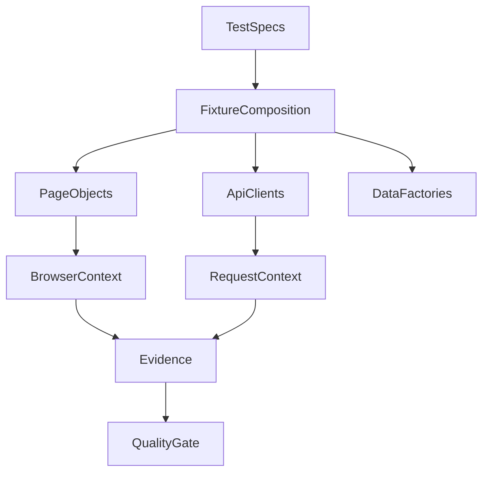

# Architecture

The framework separates orchestration from implementation details. Tests express scenarios and
assertions. Fixtures assemble pages, clients, authenticated state, and factories. Page Objects own
browser interactions. API clients own transport and parsing. Zod schemas validate runtime data at
system boundaries.

## Runtime flow

1. The environment loader resolves external variables, `.env`, and environment defaults.
2. The setup project creates a reusable, ignored `storageState` file.
3. A browser/API project receives isolated Playwright contexts.
4. Fixtures compose only the dependencies requested by a test.
5. Reporters produce HTML, JSON, and JUnit evidence.
6. The quality gate converts evidence into a release decision.

## Dependency direction

Tests may depend on fixtures, pages, clients, models, schemas, data, and assertions. Page Objects do
not depend on tests. Clients do not depend on pages. Utilities remain focused and do not become a
service locator. This direction keeps application changes local and test intent readable.

## Scaling

Workers handle safe process-level parallelism. Shards distribute files across CI agents. At greater
scale, blob reports can be merged after independent shards, authentication state can be generated
once per environment, and data namespaces can use worker IDs. The same test contract can execute in
ephemeral Kubernetes jobs using the pinned container image.
