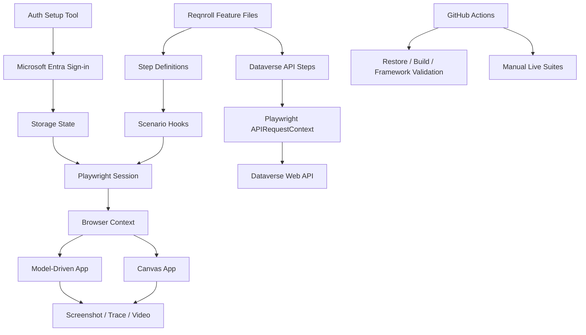

# Power Apps Playwright BDD Automation Framework

Enterprise-ready reference framework for testing **Microsoft Power Apps Canvas Apps**, **Model-Driven Apps**, and **Dataverse APIs** using **.NET 10**, **Reqnroll BDD**, **NUnit**, and **Microsoft Playwright for .NET**.

## What this framework covers

- Reqnroll / Gherkin BDD (`Given / When / Then`)
- Playwright for .NET browser automation
- Canvas App iframe handling (`iframe[name="fullscreen-app-host"]`)
- Canvas control targeting through `data-control-name`
- Model-Driven App page/component helpers
- Dataverse Web API tests through Playwright `APIRequestContext`
- Microsoft Entra sign-in bootstrap with reusable Playwright storage state
- Per-scenario browser/context isolation
- Failure screenshots and Playwright traces
- Optional video recording
- Chromium / Firefox / WebKit, with optional Microsoft Edge channel
- Environment-driven DEV / QA / UAT configuration
- Reqnroll tags for selective execution
- GitHub Actions build validation and manually triggered live suites
- No credentials, tokens, or storage-state files committed to Git

## Technology baseline

| Component | Version |
| --- | --- |
| .NET | 10.0 |
| Microsoft.Playwright | 1.63.0 |
| Reqnroll / Reqnroll.NUnit | 3.3.4 |
| NUnit | 4.6.1 |
| NUnit3TestAdapter | 6.3.0 |
| Microsoft.NET.Test.Sdk | 18.10.1 |

## Architecture



## Repository layout

```text
powerapps-dotnet-reqnroll/
├── PowerApps.Automation.sln
├── .env.example
├── src/
│   └── PowerApps.Automation.Core/
│       ├── Api/
│       ├── Browser/
│       ├── Configuration/
│       ├── PowerApps/
│       └── Utils/
├── tests/
│   └── PowerApps.Automation.Tests/
│       ├── Features/
│       │   ├── Api/
│       │   ├── Canvas/
│       │   ├── Framework/
│       │   └── ModelDriven/
│       ├── Hooks/
│       └── Steps/
├── tools/
│   └── PowerApps.AuthSetup/
├── scripts/
└── docs/
```

## Prerequisites

1. .NET 10 SDK.
2. Git.
3. A Power Platform environment and a test account with permission to the app under test.
4. A Canvas App and/or Model-Driven App URL.
5. For Dataverse API tests, a valid OAuth access token for the Dataverse resource.
6. Microsoft Edge or a Playwright-managed Chromium browser.

Microsoft's Power Platform Playwright guidance recommends testing with a dedicated test identity and reusing authenticated browser state rather than scripting interactive login inside every scenario.

## 1. Configure

```powershell
cd powerapps-dotnet-reqnroll
Copy-Item .env.example .env
```

Edit `.env`:

```ini
TEST_ENV=QA
BROWSER=chromium
BROWSER_CHANNEL=
HEADLESS=true
TIMEOUT_MS=30000
NAVIGATION_TIMEOUT_MS=60000
TRACE_ENABLED=true
VIDEO_ENABLED=false

CANVAS_APP_URL=https://apps.powerapps.com/play/e/<environment-id>/a/<app-id>
MODEL_DRIVEN_APP_URL=https://contoso.crm.dynamics.com/main.aspx?appid=<app-id>
MODEL_DRIVEN_READY_SELECTOR=

AUTH_STORAGE_STATE_PATH=.playwright-auth/state.json

DATAVERSE_BASE_URL=https://contoso.crm.dynamics.com
DATAVERSE_ACCESS_TOKEN=
```

Do **not** commit `.env`, access tokens, or `.playwright-auth/`.

## 2. Restore, build, and install browser

```powershell
./scripts/setup.ps1
```

Equivalent commands:

```powershell
dotnet restore PowerApps.Automation.sln
dotnet build PowerApps.Automation.sln
dotnet build tests/PowerApps.Automation.Tests/PowerApps.Automation.Tests.csproj
pwsh tests/PowerApps.Automation.Tests/bin/Debug/net10.0/playwright.ps1 install chromium
```

To use locally installed Microsoft Edge, set `BROWSER_CHANNEL=msedge`.

## 3. Create authenticated browser state

Run:

```powershell
./scripts/auth.ps1
```

A browser opens. Complete Microsoft Entra authentication, including MFA if required, navigate until the Power App is loaded, and return to the console. Press **Enter** to save the authenticated storage state.

Default output:

```text
.playwright-auth/state.json
```

This file may contain sensitive session information. It is excluded from Git.

## 4. Run framework validation

This requires no customer app or credentials:

```powershell
dotnet test tests/PowerApps.Automation.Tests --filter "TestCategory=framework"
```

## 5. Run Canvas App tests

```powershell
dotnet test tests/PowerApps.Automation.Tests --filter "TestCategory=canvas"
```

The sample feature demonstrates Power Apps-specific control interaction:

```gherkin
When I fill Canvas control "TextInput1" with "Playwright"
And I click Canvas control "Button1"
Then Canvas control "Label1" should contain "Playwright"
```

Replace those control names with the `data-control-name` values from your app.

## 6. Run Model-Driven App tests

```powershell
dotnet test tests/PowerApps.Automation.Tests --filter "TestCategory=mda"
```

The included smoke scenario validates that the configured Model-Driven App loads. Extend it with page-specific commands, forms, grids, and entity pages through `ModelDrivenAppPage`.

## 7. Run Dataverse API tests

Set:

```ini
DATAVERSE_BASE_URL=https://<org>.crm.dynamics.com
DATAVERSE_ACCESS_TOKEN=<short-lived OAuth token>
```

Then run:

```powershell
dotnet test tests/PowerApps.Automation.Tests --filter "TestCategory=dataverse"
```

The included API scenario calls:

```text
GET /api/data/v9.2/WhoAmI
```

and validates the response contains `UserId`.

## 8. Run all configured tests

```powershell
./scripts/test.ps1 -Scope all
```

Supported scopes:

```text
framework
canvas
mda
dataverse
ui
all
```

## Canvas App selector strategy

Canvas Apps render within the Power Apps player iframe. The framework automatically scopes Canvas App interaction to:

```css
iframe[name="fullscreen-app-host"]
```

Power Apps controls can then be targeted with:

```css
[data-control-name="ControlName"]
```

This is more maintainable than generated XPath expressions. See `docs/selectors.md`.

## Authentication model

The framework deliberately separates authentication from test scenarios:

```text
Interactive Entra Sign-in
        ↓
Auth Setup Tool
        ↓
Playwright Storage State
        ↓
Per-scenario Browser Context
        ↓
Power Apps tests
```

For CI, store the storage-state JSON as a Base64-encoded GitHub secret named:

```text
POWERAPPS_STORAGE_STATE_BASE64
```

Live CI tests are manually triggered; normal PR checks never require customer credentials.

See `docs/authentication.md`.

## GitHub Actions

The repository-level workflow is:

```text
.github/workflows/powerapps-dotnet.yml
```

Every relevant PR/push performs:

1. .NET restore
2. Build
3. Reqnroll framework-validation scenario

A manual `workflow_dispatch` can additionally run Canvas, Model-Driven, or Dataverse suites after the required repository secrets have been configured.

See `docs/ci-cd.md`.

## Evidence

On a failed UI scenario the framework writes evidence below:

```text
artifacts/<scenario>/
├── failure.png
└── trace.zip
```

If `VIDEO_ENABLED=true`, Playwright video is also recorded in the scenario artifact directory.

Open a trace with Playwright Trace Viewer using any compatible Playwright installation.

## Extending for a real Power Apps project

Recommended progression:

1. Replace example Canvas control names with actual `data-control-name` values.
2. Add business-focused `.feature` files by capability, not by page.
3. Add app-specific page/component classes on top of `CanvasAppPage` and `ModelDrivenAppPage`.
4. Create test data through Dataverse/API wherever possible.
5. Verify UI outcomes through Playwright.
6. Clean up data through API.
7. Add tags such as `@smoke`, `@regression`, `@critical`, and feature/domain tags.
8. Add a dedicated non-production test identity and least-privilege security role.
9. Add quality gates only after stable baseline execution data exists.

## Security rules

- Never commit storage-state JSON.
- Never commit `.env`.
- Never commit Dataverse access tokens.
- Use a dedicated test identity.
- Apply least-privilege Power Platform roles.
- Keep production destructive operations out of automation unless explicitly approved and isolated.
- Treat screenshots, traces, videos, and downloaded files as potentially sensitive evidence.

## Microsoft references

- Power Platform Playwright samples: https://learn.microsoft.com/power-platform/developer/playwright-samples/get-started
- Power Platform sample suites: https://learn.microsoft.com/power-platform/developer/playwright-samples/samples
- Playwright .NET API testing: https://playwright.dev/dotnet/docs/api-testing
- Playwright authentication: https://playwright.dev/dotnet/docs/auth
