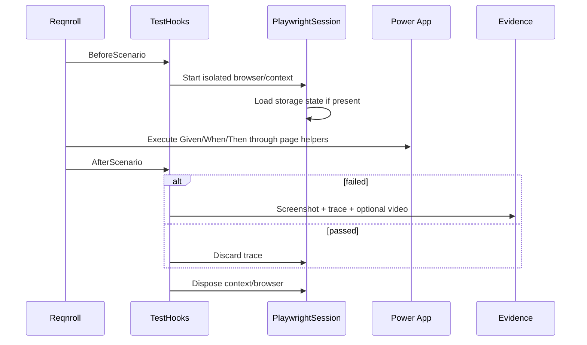

# Architecture

## Objective

Provide one maintainable automation model for Power Apps UI and Dataverse API testing while keeping authentication, browser lifecycle, app-specific controls, evidence, and CI responsibilities separated.

## Runtime flow

## Layers

| Layer | Responsibility |
| --- | --- |
| Feature files | Business-readable behavior and scenario tags |
| Step definitions | Translate business steps into framework calls |
| Hooks | Scenario lifecycle, browser startup, cleanup, evidence |
| Core pages | Power Apps-specific iframe/control and MDA interaction helpers |
| API client | Dataverse HTTP calls through Playwright APIRequestContext |
| Configuration | Environment-variable and `.env` resolution |
| Auth tool | Human-assisted Entra login and storage-state capture |
| CI | Restore, compile, deterministic validation, opt-in live tests |

## Design rules

1. No browser singleton shared across scenarios.
2. No hard-coded credentials.
3. No sleep-based synchronization.
4. Canvas selectors are scoped inside the Power Apps player frame.
5. App-specific business abstractions should extend the provided generic pages rather than placing selectors directly in step definitions.
6. API setup/cleanup is preferred over UI setup when Dataverse permissions permit it.
7. Authentication state and evidence are treated as sensitive data.
